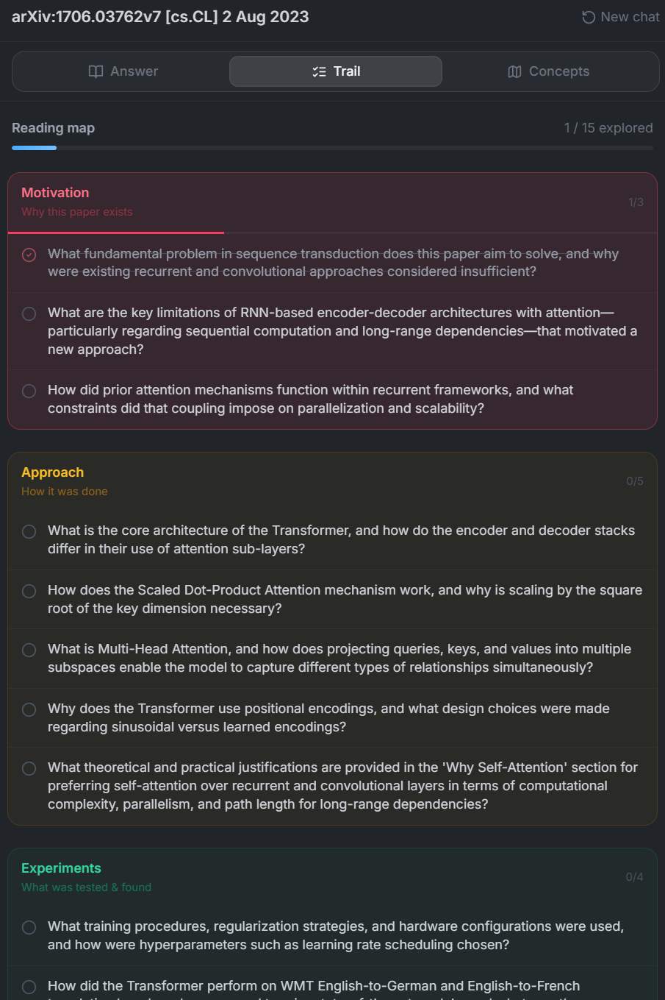
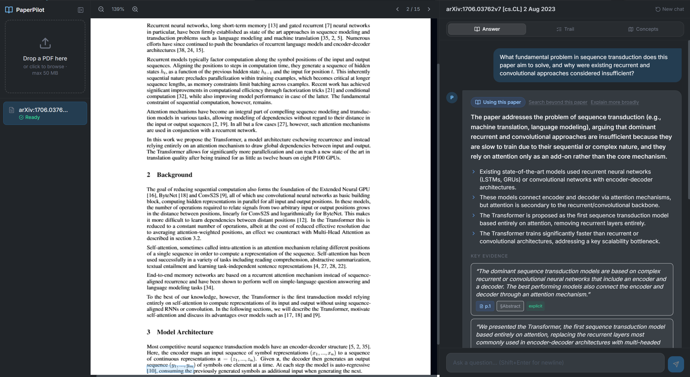
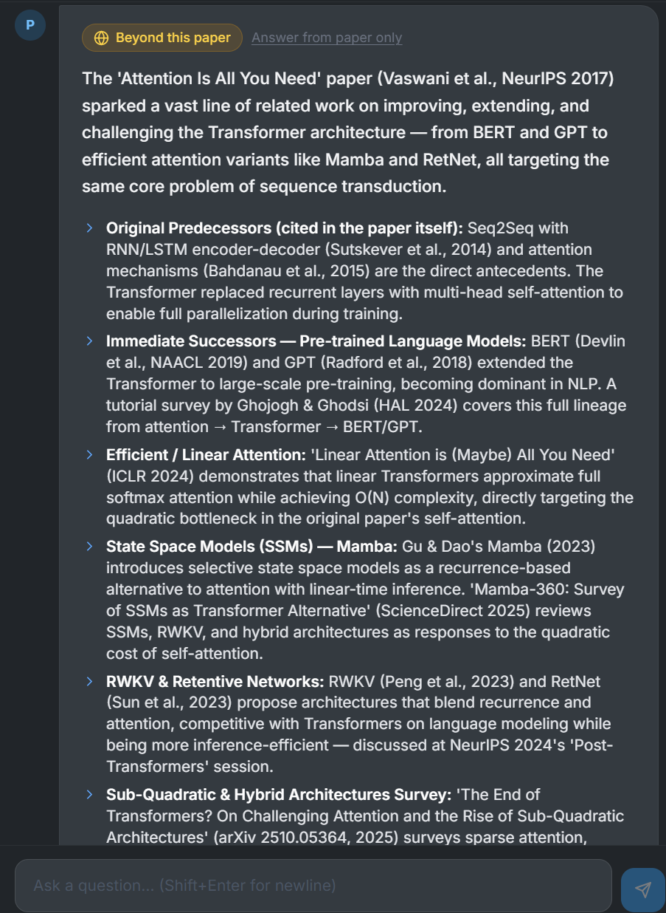
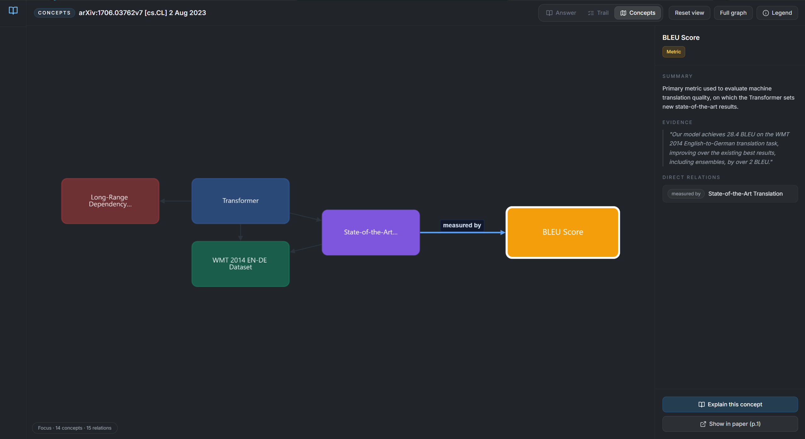

# PaperPilot

Agent-driven research assistant for PDFs: hybrid RAG, intent-routed multi-step LLM pipeline, evidence-grounded streaming Q&A, session memory, and structured concept maps.

**Guided reading trail** — staged questions across Motivation, Approach, Experiments, and Takeaways.



**Structured answers** — evidence-grounded responses with citations and streaming.





**Concept map** — LLM-generated graph of concepts and relations grounded in the paper.



**Prerequisites:** Docker + Docker Compose

## Local (Docker)

```bash
cp .env.example .env

make up
make migrate
```

## Dev (no Docker)

Prereqs: Node 20+, Python 3.11+.

```bash
# .env → local Postgres, Redis, Qdrant URLs

cd backend
pip install -r requirements.txt
alembic upgrade head
uvicorn app.main:app --reload
celery -A app.ingestion.celery_app worker -l info

cd ../frontend
npm install
npm run dev
```

## Configure LLM (in-app)

Open the app and click the **gear icon** in the left sidebar to configure:
- **Protocol**: OpenAI / OpenAI-compatible (routers like OpenRouter) / Anthropic / Gemini
- **Base URL**: auto-filled + locked for OpenAI/Gemini/Anthropic; editable for routers
- **Model**: e.g. `anthropic/claude-sonnet-4-6`
- **API key**: stored server-side per guest (Redis TTL)
- **Trail language**: presets (English, Simplified Chinese, Traditional Chinese, Japanese, Korean, Spanish, French, German, Portuguese (Brazil), Russian)

## URLs

- Frontend: `http://localhost:5173`
- Backend: `http://localhost:8000` (health: `GET /health`)

## Testing

```bash
make test-backend
```