# PaperPilot Research Director Roadmap

**Status:** implementation roadmap

**Baseline reviewed:** 2026-07-30

**Product thesis:** P0 establishes PaperPilot as a strictly pre-execution Research Director. P1 and P2 evolve the same Research Console into the evidence, policy, and orchestration control plane for a separate, isolated research-execution plane.

## 1. Outcome and product boundary

In P0, PaperPilot should turn an open research question into a versioned, evidence-backed package that another team or agent can implement and evaluate without having to reconstruct the reasoning. P0 ends at an approved handoff package and optional review of externally returned results.

The wider P1/P2 target is a governed research-engineering lifecycle in which the Research Console can authorize and observe isolated coding sandboxes, bounded experiments, analysis workers, and manuscript-production workers through explicit execution-plane adapters. These later capabilities extend the lifecycle; they do not weaken the P0 boundary or move shell, build, experiment, or publishing privileges into the control-plane service.

The complete directed workflow is:

1. Freeze a research contract.
2. Acquire and organize literature and other approved evidence.
3. Build claim-level evidence, conflict, and uncertainty maps.
4. Identify defensible gaps and novelty risks.
5. Form falsifiable hypotheses and compare alternatives.
6. Specify methods and experiment protocols.
7. Produce an implementation-ready plan with dependencies and acceptance criteria.
8. Run an independent review.
9. Revise until all Blocker and Major issues are closed.
10. Prepare a structured handoff and, optionally, review results returned by an external executor.
11. In P1/P2 only, dispatch approved implementation and experiment contracts to a separate execution plane.
12. Ingest signed code, run, metric, analysis, and manuscript artifacts; independently verify provenance and acceptance criteria.
13. Require explicit human gates before code integration, high-cost compute, promotion of material claims, and any publication action.

### Non-negotiable P0 boundary

P0 may search, read, reason, plan, review, version, export, and inspect returned evidence. It must not:

- create or modify implementation code;
- run builds, tests, benchmarks, notebooks, experiments, or GPU jobs;
- operate an IDE, shell, repository, deployment system, or experiment platform as the research executor;
- infer that an external task succeeded from dispatch or acknowledgement alone;
- label unobserved results as executed, verified, or reproduced;
- submit or publish a paper automatically.

An approved handoff means **approved for external execution**, not completed. Imported results remain **returned and unverified** until their provenance and acceptance criteria have been reviewed. No P0 API, worker, connector, or UI action may dispatch code, start a build, allocate compute, launch an experiment, produce an execution-derived claim, or publish externally.

### P1/P2 control-plane boundary

P1/P2 may orchestrate execution only through a separately deployed execution plane with least-privilege, short-lived capability grants, immutable input snapshots, declared resource envelopes, signed result manifests, cancellation, and complete audit events. The Research Console remains the source of truth for intent, policy, artifacts, gates, and lineage; it does not become the coding sandbox, shell host, experiment runner, or publishing credential holder.

Later phases may automate work inside an already approved envelope, but four decisions remain explicit human gates:

- integration or merge of generated code into an authoritative repository;
- launch or continuation of high-cost compute outside the approved resource envelope;
- promotion of material scientific claims into an accepted analysis or manuscript;
- submission, publication, or other externally visible release.

## 2. Frontier reference point

The relevant comparison is broader than one model. The vendor capabilities below are product reference points, not independent quality claims:

- **DeepSeek-R1** is a reasoning-model reference point. It demonstrates stronger test-time reasoning, but a reasoning model alone does not provide source acquisition, provenance, durable workflow state, or human research governance.
- **OpenAI deep research** sets an expectation for prompt-to-plan-to-search-to-cited-report workflows, multi-step browsing, broad source synthesis, trusted-source controls, connected data, visible progress, and mid-run intervention.
- **Google Deep Research** sets an expectation for editable plan review and approval, background asynchronous runs, continuation and event streams, web plus private-workspace retrieval, and an embeddable research-agent workflow. Preview capabilities and limitations must be rechecked before implementation.
- **xAI research workflows / DeepSearch** set an expectation for real-time retrieval, parallel investigation, explicit claim verification, reusable workflows, budgets, and pause/resume without repeating completed work.
- **Research-engineering agents** raise the end-to-end expectation from “write a report” to “literature -> design -> implementation -> experiment -> result -> paper.” P0 deliberately owns the direction, evidence, review, and handoff portions of that loop. P1/P2 retain that trust model while adding governed orchestration of a separate execution plane.

Durable async execution, editable plan approval, event streaming, and multi-agent fan-out are now baseline capabilities, not defensible differentiation. PaperPilot's differentiation should be its scientific artifact semantics: **systematic-search ledger, claim-evidence graph, gap/novelty audit, hypothesis portfolio, method/statistics/experiment packet, isolated execution manifests, code/run/analysis/manuscript lineage, independent revision ledger, and durable version history**.

Frontier assistants generally optimize for autonomous completion; PaperPilot should optimize for auditable research direction, reproducible decisions, and policy-governed coordination of replaceable execution workers.

## 3. Current position and gap

The repository already has useful foundations:

- PDF ingestion, structured chunks, embeddings, hybrid retrieval, workspace sources, and source-aware question answering;
- a bounded deep-research graph that plans sub-questions, searches and fetches pages, replans, and synthesizes a report;
- streaming progress, workflow-run persistence, tracing, rate limits, and configurable LLM providers;
- new Research Director domain objects for contracts, evidence claims, gaps, hypotheses, methods, experiment protocols, implementation work packages, reviews, revisions, and handoffs;
- strict cross-reference validation, deterministic fallback behavior, and prompts that preserve the execution boundary;
- persistence and console foundations for versioned projects, plans, reviews, and handoff bundles.

These are foundations, not an end-to-end readiness claim. P0 is complete only when the API, persistence migration, lifecycle, console, tests, and evaluation gates operate as one vertical slice.

| Dimension | Frontier expectation | PaperPilot gap to close |
|---|---|---|
| Research framing | Editable plan, scope, source policy, and intervention | Convert topic fields into a frozen, versioned contract with explicit decisions, unknowns, success criteria, and change history |
| Source acquisition | Broad and adaptive multi-query browsing across public and connected sources | Move beyond one web-search path and title-only workspace context; add a systematic-search ledger, scholarly metadata, full-text locators, deduplication, citation-graph expansion, and source snapshots |
| Evidence integrity | Atomic claims that can be checked against exact sources | Replace URL-level report attribution with claim-to-passage lineage, support/refute/conflict relations, entailment checks, and explicit unsupported status |
| Literature and novelty | Coverage-driven synthesis that pivots when evidence is missing | Add coverage accounting, prior-art search, contrary evidence, temporal cutoffs, and calibrated novelty uncertainty |
| Scientific reasoning | Alternative hypotheses, falsifiability, credible methods, controls, and statistics | Make hypothesis ranking, method selection, baselines, leakage checks, ablations, stop rules, and statistical review first-class gated artifacts |
| Long-horizon reliability | Durable, observable, interruptible, budgeted workflows | Make every stage resumable and idempotent; support pause, edit, retry, provenance-preserving replan, and cost/time budgets |
| Independent review | Separate verification context and adversarial checking | Isolate reviewer context, enforce perspective coverage, seed/check known defects, prevent the planner from self-approving, and require human closure of blockers |
| Research engineering | Structured coordination across literature, implementation, experiments, analysis, manuscripts, and results | P0 produces executor-ready contracts and accepts returned packages without dispatch. P1/P2 add an isolated execution plane, capability-scoped dispatch, signed artifacts, resumable runs, and explicit code/compute/claim/publish gates |
| Identity and governance | Authenticated actors, tenant isolation, auditable approvals, and least-privilege connectors | Treat the current caller-provided guest ID as a local-preview scope key only; add authenticated principals, actor-bound approvals, tenant-consistent constraints, secret protection, and signed transfer records before network production |
| Data governance | License-, confidentiality-, and policy-aware evidence use and export | Classify source access and export rights, redact restricted passages, and make G4 fail closed when a handoff would cross an evidence-use boundary |
| Provider and cost security | Approved model endpoints, protected credentials, and non-bypassable budgets | Validate provider destinations and block private-network/redirect credential exfiltration; use scoped secret references, authenticated rate-limit identities, per-stage budgets, and hard provider-cost caps |
| Console experience | Live progress, source inspection, decisions, artifact diffs, and intervention | Evolve from report/chat views into a project timeline with evidence drill-down, version diff, gates, budgets, audit trail, and external-result inbox |
| Evaluation | Public task quality plus reliability, cost, and factuality | Add a reproducible benchmark spanning retrieval, citation correctness, research design, reviewer effectiveness, boundary safety, and handoff usability |

## 4. Target architecture

```mermaid
flowchart LR
    U["Human research owner"] --> C["Research contract and source policy"]

    subgraph CP["PaperPilot Research Console control plane"]
        C --> O["Durable research orchestrator"]
        O --> A["Literature acquisition and source snapshots"]
        A --> E["Evidence ledger and claim graph"]
        E --> G["Gap and novelty analysis"]
        G --> H["Hypothesis portfolio"]
        H --> M["Method and experiment protocol"]
        M --> P["Implementation-ready plan"]
        P --> R["Independent review"]
        R -->|"revision required"| O
        R --> HG["Human gates and policy engine"]
        HG --> B["Versioned handoff or execution contract"]
        I["Signed result intake"] --> V["Provenance, claim, and acceptance review"]
        V --> D["Analysis and manuscript artifact graph"]
    end

    B -->|"P0: explicit export only"| X["Human-selected external executor"]
    X -->|"returned package"| I

    subgraph EP["Separate isolated execution plane"]
        S["Coding sandbox"] --> Q["Build and test worker"]
        Q --> ER["Bounded experiment runner"]
        ER --> AN["Analysis worker"]
        AN --> MW["Manuscript-production worker"]
    end
    B -->|"P1/P2: approved, capability-scoped dispatch"| S
    MW -->|"signed code, logs, metrics, analysis, manuscript artifacts"| I
    D --> U
    HG -->|"explicit publication approval only"| PUB["External publication adapter"]
```



### Architectural layers

1. **Research console** — project timeline, contract editor, workflow templates, evidence browser, run and branch comparison, artifact graph, review queue, human gates, budgets, collaboration, handoff export, and execution-result inbox.
2. **Durable control-plane orchestrator** — explicit state machine, stage budgets, checkpoints, retries, cancellation, intervention, idempotency, capability grants, and audit events. It records intent and decisions but does not execute code or experiments itself.
3. **Research services** — query planning, scholarly/web/workspace acquisition, source normalization, literature synthesis, gap analysis, hypothesis generation, method design, and plan assembly.
4. **Trust services** — passage-level citation mapping, claim verification, contradiction detection, source-quality policy, independent review, execution-envelope validation, boundary enforcement, and approval policy.
5. **Artifact system** — immutable versions, stable IDs, typed cross-references, provenance, code/run/metric/analysis/manuscript lineage, review history, diffs, supersession, and export schemas.
6. **Execution-plane adapters** — P0 exposes export/import contracts only. P1/P2 adapters exchange immutable manifests, short-lived capabilities, status events, cancellation, and signed result packages with separately deployed workers.
7. **Isolated execution plane (P1/P2)** — replaceable coding sandboxes, build/test workers, bounded experiment runners, analysis workers, and manuscript-production workers. These workers have no authority to approve code integration, expand high-cost compute, promote claims, or publish.

### Console interaction contract

The Console is the human control surface, not an execution terminal. Its default project view combines:

- a stage, run, and branch timeline with budget, stop, pause, resume, retry, and impact indicators;
- a plan workbench for contracts, search strategy, hypotheses, method choices, experiment protocols, and workflow templates;
- an evidence and artifact inspector with exact locators, claim links, version diffs, code/run/metric/analysis/manuscript lineage, and unresolved uncertainty;
- a gate inbox that presents the exact proposed version, risk, cost, tests, evidence, diff, and rollback or rejection options before a human decision;
- a collaboration layer for comments, assignments, reviewer roles, issue closure, accepted-risk ownership, and signed decisions;
- an execution-status view that displays adapter events and artifacts without exposing an unrestricted shell or silently translating worker status into scientific success.

The primary interaction pattern is `propose -> inspect/diff -> approve, revise, branch, or reject`. Users can pin or freeze an artifact version, branch from an approved hypothesis or method, compare code/run/analysis branches, and rerun only downstream affected stages. Chat can request these operations, but validated artifacts and durable gate decisions remain canonical.

## 5. Artifact and lifecycle contract

Every material decision must be represented by a versioned artifact rather than hidden in chat history.

| Artifact | Phase | Required contents |
|---|---|---|
| Research contract | P0 | question, objective, inclusions, exclusions, assumptions, constraints, source policy, unknowns, success/failure criteria, human decisions |
| Systematic-search ledger | P0 | databases and connectors, query versions, filters, time window, result counts, deduplication decisions, exclusions, and coverage/stopping rationale |
| Source snapshot | P0 | canonical identity, authors, date, URI, access time, content hash, license/access note, exact passage locators |
| Evidence ledger | P0 | atomic claim, supporting/refuting sources, passage locators, confidence, limitations, unresolved conflicts |
| Literature map | P0 | themes, methods, datasets, findings, disagreements, recency, and coverage gaps |
| Gap and novelty record | P0 | claim dependencies, contrary evidence, impact, testability, novelty confidence, and search coverage |
| Hypothesis portfolio | P0 | alternatives, falsifiable predictions, rationale, counterarguments, minimum validation, dependencies, and disposition |
| Method and experiment protocol | P0 | procedure, interfaces, baselines, datasets, controls, ablations, metrics, statistics, seeds, stop rules, risks, and expected artifacts |
| Implementation plan | P0 | work packages, inputs, outputs, dependencies, owner roles, interface contracts, acceptance criteria, milestones, unresolved decisions, and fallbacks |
| Independent review | P0 | perspectives, evidence, blocker/major/minor issues, required fixes, unresolved risks, verdict, and next action |
| Revision record | P0 | source review, addressed and unresolved issue IDs, material changes, and superseded version |
| Handoff bundle | P0 | approved plan version, frozen prerequisites, executor instructions, acceptance contract, open risks, and expected result schema |
| Returned-result review | P0 import; P1/P2 orchestrated | executor identity, artifact hashes, environment and run metadata, deviations, metric evidence, acceptance decision, and residual uncertainty |
| Execution contract | P1 | approved plan and artifact IDs, executor capability scope, immutable inputs, resource envelope, stop conditions, expected outputs, callback and cancellation contract |
| Repository and environment snapshot | P1 | repository and revision, dependency lock, container/image digest, toolchain, dataset references, secrets policy, network policy |
| Code change set | P1 | isolated branch/worktree identity, patch, changed files, rationale, generated-by metadata, static checks, tests, unresolved risks, merge-gate status |
| Build and test result | P1 | exact input snapshot, commands, environment, logs, exit status, test evidence, produced artifact hashes; an ACK is not a pass |
| Experiment run | P1 | experiment-spec version, code/data/environment hashes, seed, resource use, status events, logs, checkpoints, metrics, deviations, termination reason |
| Analysis package | P1 | accepted run IDs, transformations, statistical tests, uncertainty, tables, figures, notebooks or scripts, claim candidates, reproducibility manifest |
| Claim-promotion record | P1 | proposed claim, supporting/refuting source and run IDs, effect size, uncertainty, limitations, reviewer decision, manuscript eligibility |
| Manuscript version | P1 | section structure, accepted claim IDs, citations, figures/tables, author instructions, unresolved placeholders, version and review lineage |
| Manuscript review and revision | P1 | reviewer perspective, issue IDs, severity, requested changes, response, diff, closure decision, superseded version |
| Release candidate | P1/P2 | approved manuscript and supplementary artifacts, venue/package validation, disclosure and license checks, exact destination intent, immutable package hash |
| Publication record | P2 | G9 decision, explicit publisher identity, destination, submitted release hash, external receipt/status, timestamps, withdrawal or replacement lineage |

The graph must preserve typed relations such as `derived_from`, `implements`, `evaluates`, `produced_by`, `supports`, `refutes`, `stated_in`, `reviews`, `supersedes`, `approved_by`, and `published_as`. A manuscript sentence cannot become a material claim merely because a writer generated it; it must reference an accepted claim-promotion record.

### Canonical plan states

```text
initial draft -> review_required -> revised version (review_required)
                              \-> approved_for_handoff -> handed_off

handoff bundle: ready_for_handoff -> handed_off

Any version may also become superseded.
```

External-result states are separate:

```text
returned_unverified -> under_review -> accepted | rejected | more_evidence_required
```

P1/P2 execution states are additional and may not be emitted by P0:

```text
execution contract: proposed -> gate_pending -> approved -> dispatched
execution run: queued -> running -> paused | failed | cancelled | returned_unverified
code change: proposed -> tested -> merge_gate_pending -> integrated | rejected | superseded
claim: candidate -> verification_required -> accepted | unsupported | conflicting | superseded
manuscript: draft -> review_required -> revised -> author_approved -> release_candidate
publication: release_candidate -> publish_gate_pending -> submitted -> published | rejected | withdrawn
```

`dispatched`, `queued`, `running`, and an executor acknowledgement are transport or execution states, not evidence that a build passed, an experiment succeeded, a claim is valid, or a manuscript was published. Those transitions require signed artifacts, acceptance checks, and the corresponding human gate.

P0 must align or explicitly map lifecycle aliases across domain models, storage, API responses, and frontend state. Neither `handed_off` nor an external acknowledgement may transition a plan or result to `executed`, `verified`, or `reproduced`.

The P0 API deliberately exposes two related state layers:

| Persisted artifact status | Frozen plan lifecycle | Meaning |
|---|---|---|
| `draft` | `draft` or `review_required` | Initial or revised version awaiting an independent review |
| `reviewed` | `review_required` | Review exists; revise or record human approval |
| `approved` | `approved_for_handoff` | Human-approved plan; no execution has occurred |
| `superseded` | Frozen prior value | A newer version exists; the old snapshot is immutable |
| `handed_off` | `handed_off` | Transfer was recorded; external work is still unverified |

`ready_for_handoff` is a handoff-bundle state, not a plan execution state. Frontend labels are projections of these persisted values and must never infer execution from either layer.

## 6. Human gates

| Gate | Human decision | Minimum machine-prepared evidence |
|---|---|---|
| G0: contract freeze | Is this the right question, scope, source policy, and success definition? | Ambiguities, assumptions, exclusions, required decisions, feasibility warning |
| G1: evidence sufficiency | Is the literature set adequate for gap and novelty claims? | Coverage report, key missing sources, conflicts, unsupported claims, cutoff date |
| G2: scientific direction | Which hypothesis and method should advance? | Alternatives, counterarguments, falsifiable predictions, risks, minimum validation |
| G3: review closure | Are all Blocker and Major issues fixed? | Independent review, issue-to-revision trace, unresolved risks, reviewer coverage |
| G4: handoff approval | May this frozen version leave PaperPilot for external execution? | Work packages, interfaces, acceptance criteria, prerequisites, expected result contract |
| G5: code integration | May a tested code change leave its isolated branch and enter an authoritative repository? | Patch diff, source snapshot, tests, security/license findings, unresolved risks, rollback plan |
| G6: compute launch or expansion | May this experiment start or exceed the pre-approved resource envelope? | Experiment spec, expected information gain, dataset policy, cost/time/GPU estimate, stop rules |
| G7: result and claim acceptance | Do returned artifacts satisfy provenance and acceptance criteria, and may a material claim advance? | Signed hashes, logs/metrics, statistical checks, deviations, support/refute links, uncertainty; never an ACK alone |
| G8: manuscript approval | Is this version scientifically and editorially ready to become a release candidate? | Claim-to-text map, citation checks, figure/table lineage, reviewer issues, revision diff, unresolved disclosures |
| G9: publish authorization | May this exact release candidate be submitted or published externally? | Immutable release hash, venue/package checks, authorship, disclosures, license and policy checks, destination |

G0, G3, and G4 are mandatory in P0. G1 and G2 become mandatory as their corresponding research automation reaches production quality. G5 through G9 apply only to P1/P2 execution and manuscript workflows; G5, any G6 request outside a previously approved low-cost envelope, G7 for material claims, G8, and G9 are non-bypassable. Publication always requires G9, even at the highest autonomy setting.

## 7. Stage ownership and phase scope

| Lifecycle stage | P0: pre-execution director | P1: supervised research engineering | P2: governed autonomous programs |
|---|---|---|---|
| Research brief | Create, clarify, version, review, and freeze the research contract | Reusable parameterized briefs and organization policy packs | Continuously maintained program objectives with explicit change approval |
| Survey | Bounded workspace/web evidence, source ledger, claim map, literature synthesis | Broad scholarly connectors, snowballing, coverage-based stopping, refresh triggers | Longitudinal evidence graph, retraction/staleness alerts, selective reopening |
| Gap and hypothesis | Generate alternatives, novelty risks, falsifiable predictions; human selects direction | Multi-role critique and parameterized hypothesis workflows | Budgeted hypothesis portfolio ranked by evidence, risk, and information value |
| Method | Produce method, baseline, controls, statistics, and experiment protocol only | Freeze executor-ready method contracts and compare returned implementation options | Branch and compare multiple approved method families within policy |
| Implementation | Produce work packages and handoff schema only; no repository access or dispatch | Orchestrate isolated coding sandboxes and ingest signed patch/build/test artifacts | Multiple replaceable sandbox adapters, branch portfolios, policy-based low-risk retries |
| Experiments | Specify runs, metrics, seeds, stop rules, and expected result schema only | Orchestrate bounded approved runs in a separate execution plane | Schedule experiment matrices and adaptive low-cost runs inside a frozen envelope; high-cost expansion requires G6 |
| Analysis and claims | Define the analysis contract and review returned external results only | Orchestrate isolated analysis workers; verify statistics and gate material claims | Cross-run synthesis, contradiction tracking, selective re-analysis, multi-model verification |
| Paper | Produce handoff structure and expected manuscript contract, not execution-derived prose | Generate manuscript versions only from accepted claims, figures, and tables | Venue/domain packs, reviewer ensembles, response-letter and release-candidate workflows |
| Review and revision | Independently review and revise the pre-execution plan and handoff | Review code/run/analysis/manuscript artifacts with issue-to-diff closure | Organization policies, assigned reviewers, blind review modes, learned offline rubric candidates |
| Publish | No submission, publication, or automatic external release | Build an exportable release candidate; external publication still requires G9 | Integrate publication destinations after G9 and retain immutable external receipts |

P0 must reject P1/P2 run types and transitions at the API and worker boundaries. Merely defining their schemas in advance does not authorize their use.

## 8. Run and artifact types

Recommended control-plane run types are explicit about scope:

- **P0:** `research_direction`, `evidence_refresh`, `independent_plan_review`, `plan_revision`, `handoff_export`, and `returned_result_review`.
- **P1:** `sandbox_implementation`, `build_test_validation`, `bounded_experiment`, `analysis_generation`, `claim_verification`, `manuscript_draft`, and `manuscript_review`.
- **P2:** `experiment_matrix`, `continuous_research_refresh`, `multi_model_verification`, `release_candidate_validation`, and `publication_handoff`.

Every run pins a workflow version, input artifact versions, actor and approver identities, policy version, executor adapter and capability scope when applicable, budget, stop conditions, and expected output artifact types. Stage and task runs record attempts independently so retrying a failed experiment or manuscript section does not repeat completed survey or planning work.

Artifact payloads may live in object storage, source control, or an experiment store, but the Research Console owns the immutable metadata, content hashes, typed edges, status, approvals, and audit history. External object existence alone is not proof of acceptance.

## 9. Workflow templates

| Template | Phase | Directed stages and mandatory gates |
|---|---|---|
| Research Direction Packet | P0 | brief -> survey -> gap -> hypothesis -> method -> implementation/experiment plan -> independent review -> revision -> G4 handoff |
| Literature-to-Hypothesis | P0 | brief -> systematic search -> evidence map -> novelty audit -> hypothesis portfolio -> G2 selection -> reviewed handoff |
| Paper Replication | P1 | approved paper/method contract -> G4 dispatch -> sandbox reconstruction -> build/test -> bounded baseline run -> G7 result acceptance -> analysis -> optional G5 integration -> manuscript review |
| Benchmark or Model Evaluation | P1 | evaluation brief -> dataset/metric approval -> harness sandbox -> bounded run matrix -> G6 when required -> analysis -> G7 claims -> optional G5 integration -> report/manuscript |
| Baseline Improvement and Ablation | P2 | survey refresh -> hypothesis branch -> method variants -> sandbox branches -> experiment matrix -> analysis comparison -> G7 promotion -> manuscript revision |
| Full Manuscript and Revision | P1/P2 | accepted claims/figures/tables -> manuscript draft -> independent reviewers -> revision ledger -> G8 release candidate -> G9 publication |
| Continuous Research Program | P2 | scheduled source/code/result refresh -> impact analysis -> affected-stage rerun -> artifact and claim diff -> human review -> selective manuscript reopening |

Each template must declare typed inputs and outputs, allowed adapters, data and network policy, budget, retry and stop rules, gate policy, quality checks, cancellation behavior, and expected provenance. Templates are versioned; a running program never silently adopts a newer template.

## 10. P0 to P2 delivery plan

### P0 — Trustworthy Research Director vertical slice

**Goal:** one user can move from a research contract to an approved, versioned handoff without PaperPilot crossing into execution.

Deliverables:

- Freeze the Research Director schemas, endpoint payloads, lifecycle states, and execution-boundary invariants.
- Run Alembic under a database advisory lock as a deployment gate before API workers; production workers must never race `create_all` or start against an unapplied Research Director schema.
- Establish an explicit Alembic baseline for the pre-existing PaperPilot schema, then remove the temporary lock-serialized legacy `create_all` compatibility bootstrap; a blank deployment and an upgraded deployment must converge on the same inspected schema.
- Complete project, plan-version, review, revision, approval, supersession, bundle preparation, and explicit handoff-confirmation persistence with a forward/backward-tested migration.
- Integrate contract intake, supplied/workspace evidence, claim maps, gaps, hypotheses, methods, experiment protocols, work packages, and handoff generation.
- Require exact evidence IDs and locators for supported material claims; preserve unsupported and unknown states instead of fabricating coverage.
- Run the independent review in a clean context with required perspectives for evidence, novelty, method, experiment design, statistics, implementation readiness, risk, and boundary safety.
- Enforce G0, G3, and G4 server-side; frontend buttons are representations of policy, not the policy itself.
- For any network deployment, replace asserted guest IDs with authenticated principals; bind workspace, artifact, approval, and handoff records to the authenticated actor and enforce tenant consistency in storage. Guest scoping alone is not authentication.
- Add evidence confidentiality, license, and export-policy fields; G4 must block or redact a bundle that is not approved to cross the external handoff boundary.
- Restrict model/provider URLs through an outbound policy, keep credentials in a scoped secret store, and make request and spend limits actor-bound so caller-chosen identifiers cannot bypass them.
- Ship the console path for artifact navigation, evidence inspection, revision instructions, issue closure, version history, and handoff export.
- Add durable run IDs, structured events, latency/token/cost accounting, failure reasons, deterministic retries, and safe fallback labeling.
- Add a golden evaluation set, adversarial boundary tests, seeded-review defects, schema/property tests, migration tests, API transition tests, and frontend workflow tests.
- Export a machine-readable handoff and external-result contract. Preparing or downloading the bundle does not mark it handed off; an explicit transfer confirmation is required, and execution is never dispatched automatically.
- Define future execution, code, experiment, analysis, manuscript, and publication schemas as inert contracts only. P0 routing, workers, credentials, feature flags, and APIs must reject their dispatch and lifecycle transitions.

P0 exit criteria:

- 100% of supported material claims have a resolvable source and passage locator; claims without this are visibly unsupported or unknown.
- At least 90% citation-entailment precision on a human-labeled P0 benchmark.
- 100% schema and cross-reference validity across generated, revised, persisted, and exported artifacts.
- At least 90% detection of seeded blocker issues and 100% completion of required reviewer perspectives.
- Zero forbidden execution, verification, or publishing claims across the boundary red-team suite.
- Zero outbound code, build, test, notebook, experiment, compute-allocation, repository-write, manuscript-submission, or publication calls from every P0 service and connector under integration and red-team tests.
- 100% rejection of P1/P2 run types, capability grants, execution transitions, code-integration actions, and publish actions by a P0 deployment.
- 100% server-side rejection of invalid lifecycle transitions and handoff attempts with open blockers.
- At least 95% successful resume from injected failures without duplicate versions or repeated completed stages.
- A researcher can inspect why each gap, hypothesis, method choice, review issue, and work package exists from the console.

### P1 — Supervised Research Engineering Console

**Goal:** make the director dependable on broad, ambiguous, multi-hour research tasks and add one production-quality path from an approved plan through isolated implementation, bounded experiments, analysis, and a reviewable manuscript—without placing execution privileges in the control plane.

Deliverables:

- Add scholarly adapters such as OpenAlex/Crossref, Semantic Scholar, PubMed, and arXiv where domain and licensing permit; preserve a systematic-search ledger and normalize DOI, version, retraction, and duplicate records.
- Add citation-graph expansion, query diversification, backward/forward snowballing, temporal and venue filters, source-quality tiers, and coverage-based stopping.
- Snapshot retrieved evidence with hashes and passage coordinates so later plan versions can be reproduced against the same corpus.
- Add claim decomposition, dual-pass entailment checking, contradiction clusters, uncertainty calibration, and automatic search reopening when high-impact claims are weak.
- Use isolated role agents for librarian, evidence auditor, novelty skeptic, method reviewer, statistician, and implementation-plan reviewer; aggregate through structured artifacts, not shared free-form chat.
- Add pause/edit/resume, budget controls, partial-result recovery, stage-level replanning, model routing, caching, and duplicate-work prevention.
- Add a versioned execution-adapter contract for one isolated coding sandbox and one bounded experiment runner. The adapter receives immutable inputs and a short-lived capability; the control plane receives status events and signed outputs but never receives shell, repository, or cloud-admin credentials.
- Add repository revision, branch/worktree, dependency lock, container image, dataset, seed, network policy, and secret-usage snapshots to every implementation and experiment run.
- Generate code changes only in isolated branches; ingest patch, static-check, build, and test artifacts; enforce G5 before any integration into an authoritative repository.
- Add experiment resource envelopes, queueing, leases, cancellation, checkpoint and retry policies, metric/log collection, and hard stop rules. Low-cost trials may proceed only inside a human-approved envelope; high-cost launch or expansion requires G6.
- Add result-package ingestion and deviation analysis for both externally returned P0 work and P1-orchestrated workers. Acceptance examines supplied signed evidence and never infers success from dispatch or acknowledgement.
- Add isolated analysis workers that consume accepted ExperimentRun artifacts and produce reproducible transformations, statistical tests, uncertainty, figures, tables, and claim candidates.
- Add G7 claim promotion so only accepted claims may enter a manuscript; unsupported and conflicting claims remain visible and cannot be laundered through prose generation.
- Add manuscript drafting, citation and figure/table lineage, independent methodology/statistics/reproducibility/writing reviews, revision plans, issue-to-diff closure, and G8 release-candidate approval. P1 may export a candidate but cannot publish without G9.
- Ship the Paper Replication and Benchmark or Model Evaluation templates end to end, including run/branch comparison and artifact diffs in the console.
- Add project-level dashboards for evidence coverage, open uncertainty, review debt, execution status, resource use, cost, claim readiness, manuscript readiness, and handoff or release readiness.

P1 exit criteria:

- At least 85% recall of a curated set of decisive prior work at the frozen search cutoff.
- At least 90% precision and recall for seeded support/refute/unsupported claim relations.
- At least 80% of domain reviewers rate gap defensibility, hypothesis falsifiability, method validity, and experiment completeness at 4/5 or better.
- Long-running workflows meet a 99% no-data-loss target under restart, timeout, provider failure, and user intervention tests.
- Median human time from approved contract to approved handoff is reduced by at least 50% against a measured manual baseline without lowering review scores.
- One independently selected replication or benchmark project completes the approved `contract -> survey -> method -> isolated patch/build/test -> bounded experiment -> analysis -> claim review -> manuscript draft` path through the separate execution plane.
- 100% of executed runs pin resolvable code, data, environment, configuration, seed, executor, resource, log, metric, and output hashes; at least 95% of accepted benchmark runs reproduce within their predeclared tolerance when rerun from those snapshots.
- At least 95% successful resume or safe terminal recovery under injected sandbox, build, experiment, analysis-worker, callback, and control-plane failures, with no duplicate accepted runs or repeated completed stages.
- Zero code integrations without G5, zero compute outside the approved envelope without G6, zero material manuscript claims without G7, and zero external publication without G9 across API, worker, adapter, and adversarial tests.
- 100% of material manuscript claims, figures, and tables resolve to accepted source evidence or accepted ExperimentRun/AnalysisPackage artifacts and their exact versions.
- Execution-plane tenants, credentials, networks, filesystems, and compute quotas pass the isolation threat model and penetration suite; compromise of one worker cannot grant control-plane or cross-project access.

### P2 — Top-tier Autonomous Research Console

**Goal:** win on trust, controllability, reproducibility, and research-cycle throughput by governing multiple replaceable execution workers and continuous research programs from one artifact-first control plane.

Deliverables:

- Add model ensembles and evidence-conditioned routing with measured quality/cost trade-offs rather than a fixed “strongest model” assumption.
- Add domain packs with specialized source policies, review rubrics, method templates, statistics checklists, and result contracts.
- Maintain a longitudinal evidence graph with change detection, retraction alerts, staleness signals, and selective plan-review reopening.
- Support reusable, parameterized research workflows and organization-approved templates while preserving per-run contracts and provenance.
- Add collaborative decisions, comments, role-based approvals, accepted-risk ownership, and signed handoff/result records.
- Add multiple execution-plane adapters for approved sandbox, CI/build, CPU/GPU/cluster, experiment-tracking, analysis, and manuscript-production environments behind one capability-scoped contract; adapters remain independently deployable and replaceable.
- Add experiment matrices for approved baselines, seeds, ablations, robustness checks, and parameter sweeps; schedule or stop only within a frozen policy and resource envelope, and reopen G6 before any high-cost expansion.
- Add hypothesis/method/code/run branches, cross-branch comparison, selective promotion, and impact analysis so a source, code, or result change reruns only affected stages while preserving old lineage.
- Add continuous research triggers for new literature, retractions, source changes, code revisions, dataset versions, or accepted experiment results; each trigger records why the program reopened and which gates became invalid.
- Add multi-model and multi-reviewer verification for high-impact claims, with explicit disagreement artifacts rather than forced consensus.
- Add venue and organization manuscript packs, response-letter workflows, supplementary-material validation, release bundles, and destination adapters that can act only after G9 and return immutable external receipts.
- Learn from human issue dispositions and outcome reviews through offline evaluation and prompt/policy candidates; require benchmark validation and staged rollout before production changes.
- Provide blind benchmark comparison against current frontier tools and research-engineering baselines on source coverage, citation correctness, research-design quality, implementation and run reproducibility, reviewer defect detection, lifecycle reliability, cost, and human time saved.

P2 exit criteria:

- Statistically supported non-inferiority on source coverage and factual correctness versus the strongest available deep-research baseline.
- A majority blind-review preference for PaperPilot on evidence traceability, plan actionability, risk disclosure, and handoff completeness.
- Calibrated confidence: low-confidence artifacts fail closed into more research or human review rather than receiving approval.
- No critical boundary violation in continuous red-team, integration, and production audit samples.
- Every production recommendation, gate, review, capability grant, code/run/analysis/manuscript artifact, export, publication action, and returned-result decision is reconstructable from immutable artifacts and audit events.
- At least one multi-week Continuous Research Program processes source and result changes, reruns only affected stages, preserves prior branches, and never expands compute or publishes without the required gate.
- At least 95% of accepted benchmark experiment results and generated figures/tables reproduce from frozen snapshots within predeclared tolerances across supported execution adapters.
- Median human review time from approved method to author-approved release candidate is at least 40% below a measured supervised baseline without reducing claim-citation, statistical, reproducibility, or reviewer scores.
- Zero unauthorized code merges, high-cost compute expansions, material-claim promotions, or publication actions in continuous policy, red-team, and production audit samples.

Initial numeric targets should be frozen with benchmark definitions and adjusted only through a documented baseline review. No phase advances based only on model self-grading.

## 11. Implementation sequencing

The critical path is trust architecture first, then breadth and autonomy.

1. **Contract and lifecycle freeze** — align backend, storage, and frontend vocabulary; define transition rules, artifact IDs, version semantics, and forbidden states.
2. **Vertical persistence and API** — project creation, plan generation, review, revision, approval, handoff, retrieval, and migration; make every operation idempotent and guest/workspace scoped.
3. **Evidence substrate** — normalized sources, immutable snapshots, passage locators, evidence ledger, claim links, conflict representation, and coverage accounting.
4. **Research reasoning** — literature map, gap/novelty analysis, hypothesis alternatives, method comparison, experiment protocol, and implementation work packages.
5. **Independent review and gates** — isolated reviewer, rubric coverage, issue lifecycle, revision trace, approval enforcement, and boundary tests. Auditable accepted-risk policy is a later capability, not a P0 approval bypass.
6. **Research console integration** — project timeline, artifact drill-down, evidence preview, version diff, review queue, intervention, budgets, and explicit handoff state.
7. **Evaluation and observability** — golden tasks, seeded defects, transition/property tests, failure injection, tracing, cost/latency, and human review studies.
8. **P0 external handoff and result intake** — schema validation, signed export/import, deviation and acceptance review; no P0 executor credentials, dispatch path, or runtime privileges.
9. **P1 source and reliability expansion** — scholarly connectors, citation graphs, durable orchestration, multi-role review, and calibrated stop/research-more decisions.
10. **P1 execution-plane foundation** — capability-scoped adapter contract, sandbox and runner isolation, repository/environment snapshots, code/build/test/run artifacts, cancellation, signed result intake, and G5/G6 enforcement.
11. **P1 analysis and manuscript loop** — reproducible analysis packages, G7 claim promotion, manuscript versions, independent review, revision ledger, G8 release candidate, and G9-protected export destination.
12. **P2 program automation** — execution-adapter portfolio, experiment matrices, branch comparison, longitudinal evidence and result maintenance, selective reruns, collaboration, and organization policy.
13. **P2 optimization and benchmarking** — domain packs, model routing, publication adapters, continuous quality evaluation, staged rollout, and live head-to-head benchmarking.

### Parallel workstreams and ownership boundaries

- **Artifact contract:** schemas, validators, lifecycle policy, migration, API compatibility.
- **Evidence system:** acquisition, normalization, snapshots, locators, claim graph, verification.
- **Director reasoning:** gap, hypothesis, method, experiment, and implementation-plan generation.
- **Review system:** independence, rubrics, issue lifecycle, approval policy, red-team cases.
- **Console:** explainability, workflow templates, intervention, run/branch/version comparison, artifact graph, decisions, execution status, collaboration, handoff/result/manuscript UX.
- **Execution contract:** capability grants, adapters, manifests, signed events, cancellation, idempotency, and control-plane/execution-plane trust boundary.
- **Execution infrastructure (P1/P2 only):** isolated sandboxes, build/test workers, bounded experiment runners, analysis workers, quotas, network and secret policy, and reproducibility snapshots.
- **Manuscript and release:** accepted-claim assembly, citation/figure/table lineage, reviewer roles, revision closure, release validation, and G8/G9 enforcement.
- **Quality platform:** benchmarks, human labels, reliability tests, observability, cost governance.

Each workstream must deliver evaluation fixtures with its implementation. Integration should happen artifact by artifact, not through hidden prompt dependencies.

## 12. Key design decisions

1. **Artifact-first, not transcript-first.** Chat may help users edit intent, but canonical state lives in validated, versioned artifacts.
2. **Evidence before confidence.** Confidence never substitutes for a source locator or claim check.
3. **Independent review is a separate operation.** The planner cannot approve its own output, and reviewer context must not inherit private planner reasoning.
4. **Human approval is explicit and durable.** UI acknowledgement, model verdict, API success, external dispatch, and real-world success are distinct events.
5. **Fallbacks fail visibly.** Deterministic or degraded generation remains draft/review-required and cannot silently become handoff-ready.
6. **The console is the product moat.** It should automate coordination, inspection, revision, and governance across the research lifecycle—not merely display a final report.
7. **P0 is permanently pre-execution.** Future schemas or roadmap intent do not authorize P0 to write code, launch compute, run experiments, generate execution-derived claims, or publish.
8. **The execution plane is separate and replaceable.** P1/P2 orchestrate coding, build/test, experiment, analysis, and manuscript workers through capability-scoped contracts; the control plane never becomes the sandbox or runner.
9. **Transport is not success.** Dispatch, queue acceptance, worker completion, artifact upload, code integration, claim acceptance, and publication are distinct persisted events with different evidence and gates.
10. **Four consequential gates remain human.** Code merge, high-cost compute, material scientific claims, and external publication cannot be authorized by a model, worker, UI shortcut, or prior unrelated approval.
11. **Reproducibility is an artifact contract.** Accepted experimental and manuscript outputs pin code, data, environment, configuration, seeds, transformations, source evidence, and reviewer decisions.

## 13. Frontier sources used for this roadmap

- [OpenAI: Introducing deep research](https://openai.com/index/introducing-deep-research/)
- [OpenAI: Deep research in ChatGPT](https://help.openai.com/en/articles/10500283-deep-research-in-chatgpt)
- [Google: Deep Research Agent with the Gemini API](https://ai.google.dev/gemini-api/docs/deep-research)
- [Google: Gemini Deep Research and connected apps](https://blog.google/products-and-platforms/products/gemini/deep-research-workspace-app-integration/)
- [Google: Build with the Deep Research agent](https://blog.google/innovation-and-ai/technology/developers-tools/deep-research-agent-gemini-api/)
- [xAI: Grok workflows and deep research](https://x.ai/news/workflows)
- [xAI: Grok 4.1 Fast and Agent Tools API](https://x.ai/news/grok-4-1-fast)
- [xAI: Grok automations](https://x.ai/news/grok-automations)
- [DeepSeek-R1 repository](https://github.com/deepseek-ai/DeepSeek-R1)
- [DeepSeek-R1 paper](https://arxiv.org/abs/2501.12948)
